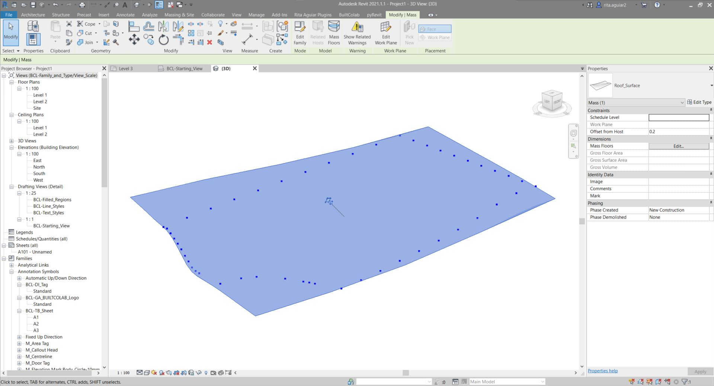
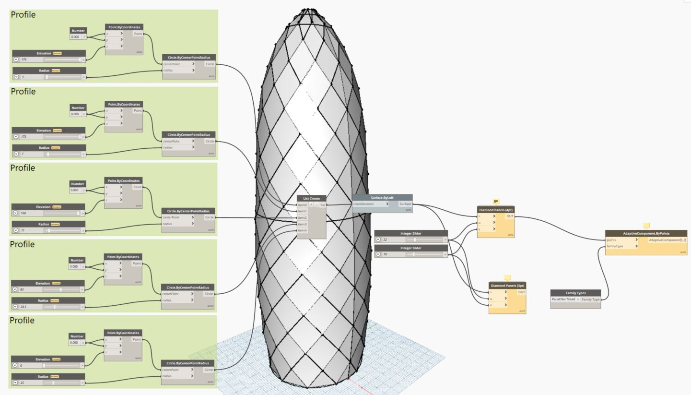
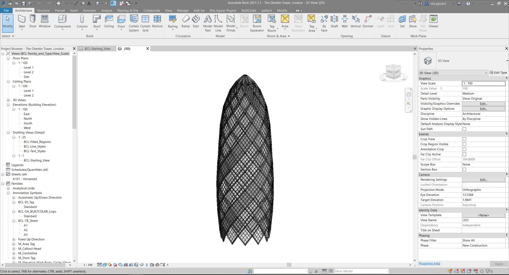

# MyDynamoScripts
A collection of my dynamo scripts

## Project EXPO 1.11
This script entails the generation of a Roof Surface (Mass Category) that is later used to create a roof by face and thus obtaining the slippery slope slab that characterizes this project. Check out a render of the project [here](https://www.instagram.com/p/B7GvLJNnoho/).

## Project The Gherkin Tower
This script generates the Facade Design of The Gherkin Tower using Generic Model Adaptive Component Elements, by following a [youtube tutorial](https://www.youtube.com/watch?v=NS0JboPxa78).

